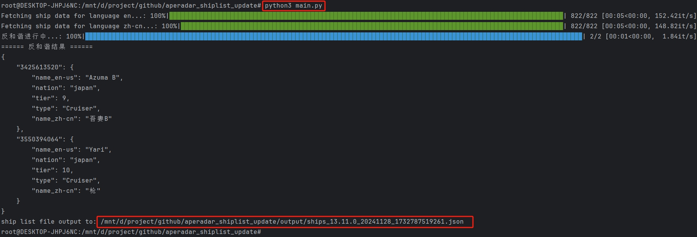
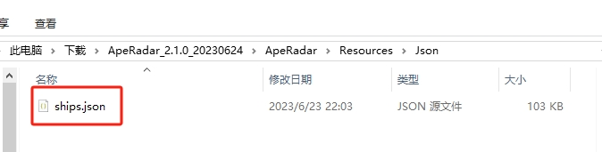

# 海猴雷达船名列表更新脚本

## 目录
1. [简介](#简介)
2. [使用方法](#使用方法)
3. [关于反和谐](#关于反和谐)

## 简介
> **本项目**

本项目是使用Python实现的、一键更新海猴雷达船名列表的脚本，附带反和谐功能。

> **什么是海猴雷达**

海猴雷达是国内某窝窝屎玩家大佬开发的一款软件，用于<b>实时展示战舰世界对局玩家数据</b>  
首先致敬原作者：[海猴雷达官方网站](https://lxdev.org/aperadar/)


> **为何开发本项目**

海猴雷达是支持船名列表自动更新功能的，这一功能依赖海猴雷达官方网站数据；


但由于原作者似乎在游戏13.8版本之后就不再在官方网站上更新船名列表，导致新船数据展示时显示 “未知船只” 字样，影响使用体验；


故<b>需要一种辅助性手段来实现随游戏版本快速更新船名列表。  


[点击查询官方最新船名列表版本](https://lxdev.org/aperadar/updateinfo/)


## 使用方法
运行本脚本即可输出兼容海猴雷达读取格式的最新船名列表文件 `ships.json`。

脚本的运行依赖Python 3环境，以及少数第三方库。[安装Python 3](https://www.python.org/downloads/)

如果你不熟悉Python，或者懒得动手，也可以跳过前3步，直接使用现成的 `ships.json` 资源文件。

- **第一步**: 安装依赖

在项目根目录下运行命令：

``pip install -r requirements.txt``

- **第二步**: 配置API参数

找到项目根目录下的config.yaml文件，填写百度翻译API和WG API相关参数，这些令牌和密钥都可以免费获取；
请参考：
1. [WarGaming开发者平台 - Getting Started](https://developers.wargaming.net/documentation/guide/getting-started/)
2. [百度翻译开放平台 - 介绍](https://fanyi-api.baidu.com/doc/11)

- **第三步**: 运行脚本

在项目根目录下运行命令：

``python3 main.py``

若一切运行正常，你将看到如下输出：



这代表最新的船名列表文件已经输出到output目录下，可供使用了。

- **第四步**: 更新船名列表文件

找到本地安装海猴雷达的目录，覆盖以下文件：

``{ApeRadarRoot}\Resources\Json\ships.json``

举例说明，如图所示：



注意，如果你担心数据出错，在覆盖前请先备份旧文件，比如 `ships_backup.json`！

## 关于反和谐
目前反和谐的实现逻辑比较粗糙，有心者可以参考 `fan_he_xie.py` 代码实现逻辑。

如果想人工干预反和谐的规则，可以修改 `resources/en2cn.txt` 词典文件内容，追加你期望的翻译，然后再运行脚本；

词典文件格式为： 

`{name_en-us}|||{name_zh-cn}`

比如：

```
Zaō|||藏王
Xin Zhong Guo 14|||新中国14
```