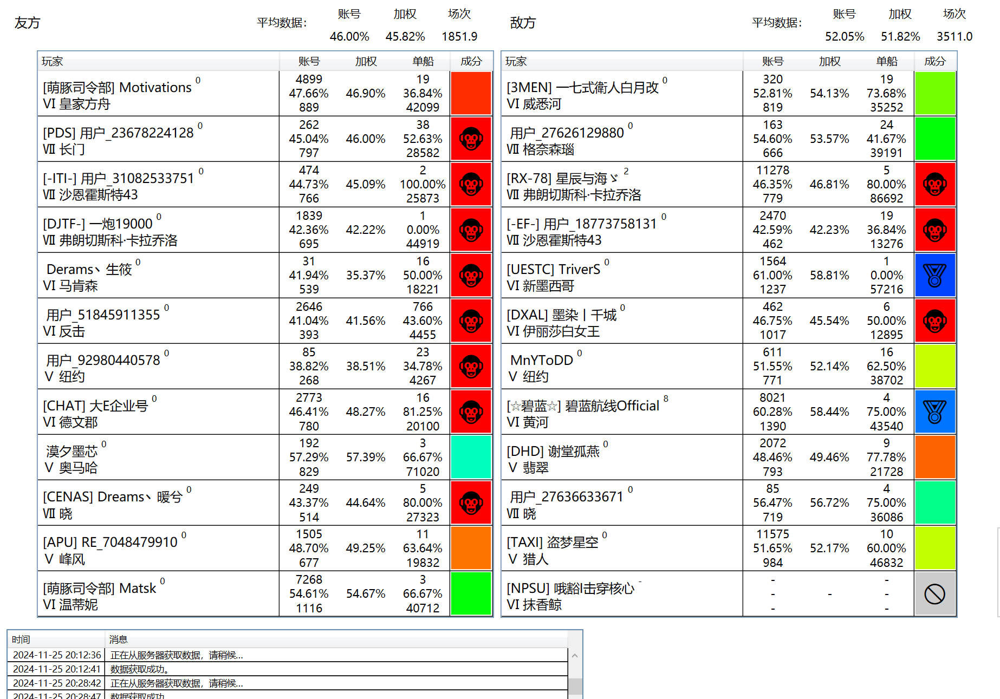
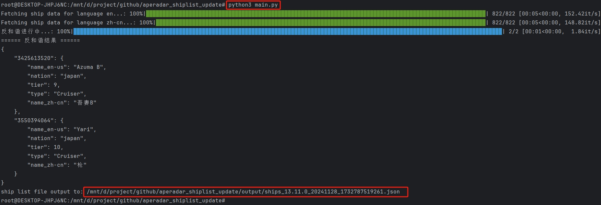
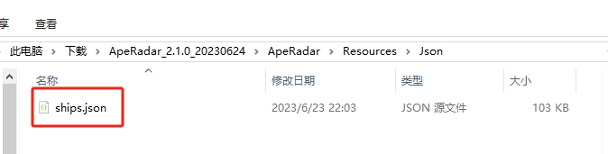

# Sea Monkey Radar Ship Name List Update Script

> **Note:** This document is translated by GPT4o.

## Table of Contents
1. [Introduction](#Introduction)
2. [Usage Instructions](#Usage-Instructions)
3. [About Anti-Censorship](#About-Anti-Censorship)

## Introduction
> **About This Project**

This project is a Python-implemented script for one-click updating of the Sea Monkey Radar ship name list, with an added anti-censorship feature.

> **What is Sea Monkey Radar**

Sea Monkey Radar is a software developed by a prominent gamer in China for **real-time display of player data in World of Warships matches.**  
Firstly, a salute to the original author: [Sea Monkey Radar Official Website](https://lxdev.org/aperadar/)


> **Why Develop This Project**

Sea Monkey Radar supports automatic ship name list updates, which rely on data from the official Sea Monkey Radar website;  
However, it seems the original author stopped updating the ship name list on the official website after game version 13.8, resulting in new ships being displayed as "unknown ships," which affects user experience;  
Therefore, **an auxiliary means is required to quickly update the ship name list with game versions.**  

[Click here to check the official latest ship name list version](https://lxdev.org/aperadar/updateinfo/)

## Usage Instructions
Running this script will output the latest ship name list file, `ships.json`, in a format compatible with Sea Monkey Radar.

The script depends on a Python 3 environment and a few third-party libraries. [Install Python 3](https://www.python.org/downloads/). If you are not familiar with Python or prefer not to do it yourself, you can skip the first 3 steps and use the ready-made `ships.json` resource file.

- **Step 1**: Install Dependencies

Run the command in the project root directory:

``pip install -r requirements.txt``

- **Step 2**: Configure API Parameters

Find the `config.yaml` file in the project root directory and fill in the Baidu Translate API and WG API related parameters, which can be obtained for free;  
Refer to:
1. [WarGaming Developer Platform - Getting Started](https://developers.wargaming.net/documentation/guide/getting-started/)
2. [Baidu Translate Open Platform - Introduction](https://fanyi-api.baidu.com/doc/11)

- **Step 3**: Run the Script

Run the command in the project root directory:

``python3 main.py``

If everything runs smoothly, you will see the following output:



This indicates that the latest ship name list file has been output to the output directory and is ready for use.

- **Step 4**: Update Ship Name List File

Find the directory where Sea Monkey Radar is locally installed and overwrite the following file:

``{ApeRadarRoot}\Resources\Json\ships.json``

For example:



Note: If you're concerned about data errors, please back up the old file before overwriting, e.g., `ships_backup.json`!

## About Anti-Censorship
Currently, the anti-censorship logic is relatively crude. Those interested can refer to the `fan_he_xie.py` code logic.  
If you want to manually intervene in the anti-censorship rules, you can modify the `resources/en2cn.txt` dictionary file content, adding the translations you desire, and then run the script again;

The dictionary file format is: 

`{name_en-us}|||{name_zh-cn}`

For example:

```
Zaō|||藏王
Xin Zhong Guo 14|||新中国14
```